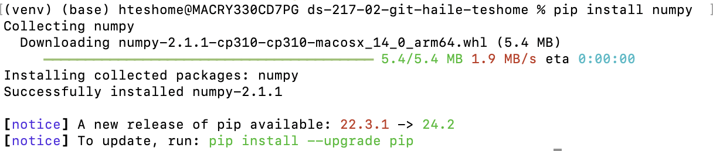

# Background
Hello Professor Seaman,
My name is Haile and I'm a student in your DATASCI 217 class, it was great to meet you yesterday! First, I attached my solution to the problem to this email and my Github profile is: "haile-teshome". 

Second, a little about me is that I'm a first year Health Data Science masters student here at UCSF and I'm also a software engineer working in the biotech industry. I was interested in developing my career into a machine learning engineer and wanted to focus on the modeling and analytical portion of the skill set required and have been working on that through this degree. This course in particular was really interesting to me because it focuses on the "glue" that makes software work together and im particularly interested in the HPC and CUDA portions of this course as working at scale using this infrastructure is a great way to increase the impact of the work you can accomplish.

Looking forward to this course,
Haile

# [Python Official Website](https://www.python.org)

## Pictures

